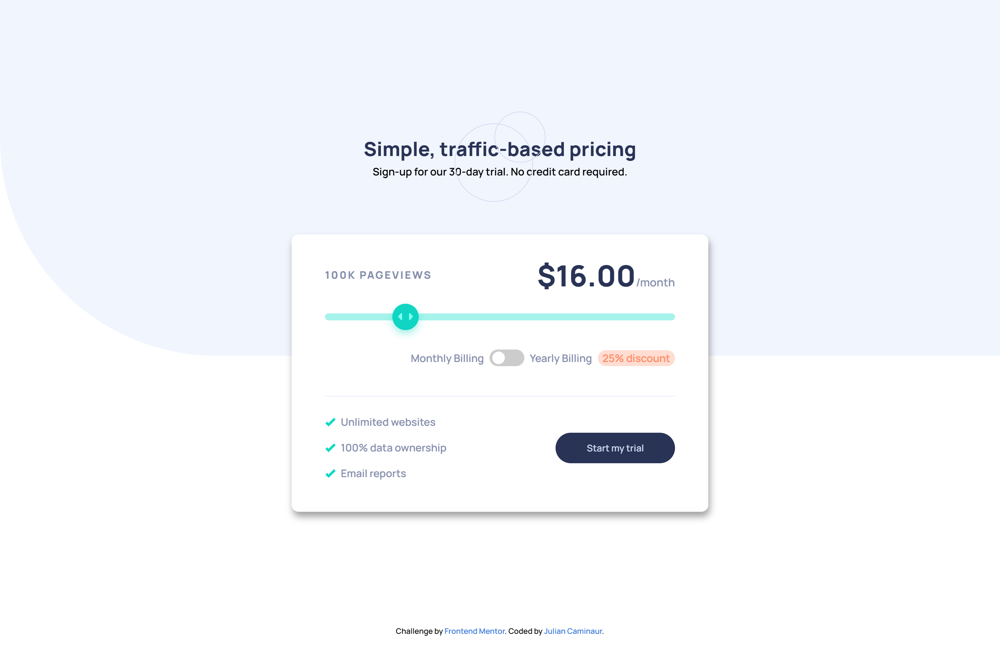

# Frontend Mentor - Interactive Pricing Component

## Table of Contents

- [Overview](#overview)
  - [The Challenge](#the-challenge)
    - [Desktop](#challenge-desktop)
  - [My Solution](#my-solution)
    - [Desktop](#desktop)
    - [Mobile](#mobile)
  - [Links](#links)
- [My Process](#my-process)
  - [Built With](#built-with)
  - [What I Learned](#what-i-learned)
  - [Useful Resources](#useful-resources)
- [Author](#author)

## Overview

### The challenge

Users should be able to:

- View the optimal layout for the app depending on their device's screen size
- See hover states for all interactive elements on the page
- Use the slider and toggle to see prices for different page view numbers

#### Challenge-Desktop

### My Solution

#### Screenshot

##### Desktop

##### Mobile

### Links

- Live Site URL: [Live Site](https://caminaur.github.io/Frontend-Mentor---Interactive-pricing-component/)
- Solution Repository: [Github](https://github.com/Caminaur/Frontend-Mentor---Interactive-pricing-component)

## My Process

### Built With

- Semantic HTML5 markup
- CSS custom properties
- Flexbox / CSS Grid
- Javascript

### What I learned

It was surprisingly interesting to go through the steps needed to make a custom input range selector.

### Useful Resources

- [CSS Grid Guide by MDN](https://developer.mozilla.org/en-US/docs/Web/CSS/CSS_Grid_Layout)
- [JavaScript Event Documentation](https://developer.mozilla.org/en-US/docs/Web/API/Event)

## Author

- [Website](https://julian-caminaur.tech/)
- [Frontend Mentor](https://www.frontendmentor.io/profile/Caminaur)
- [CSS Battle](https://cssbattle.dev/player/caminaur)
- [Exercism](https://exercism.org/profiles/Caminaur)
